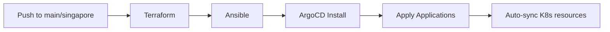
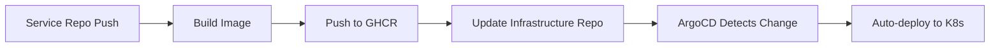

# CSO2 Infrastructure - AI Agent Guide

> **Purpose**: This document provides structured context for AI agents working on this infrastructure codebase.
> **Last Updated**: December 16, 2025
> **Current State**: Production-ready with Singapore regional deployment

---

## 📋 QUICK CONTEXT

```yaml
project: CSO2 Computer Store Platform
type: Microservices E-commerce Application
infrastructure: AWS (ap-southeast-1)
orchestration: Kubernetes (kubeadm)
gitops: ArgoCD
ci_cd: GitHub Actions
iac: Terraform + Ansible
```

---

## 🏗️ ARCHITECTURE OVERVIEW

### Repository Structure

```
Infrastructure/
├── cso2/
│   ├── .github/workflows/    # CI/CD pipelines
│   │   └── deploy.yml        # Main infrastructure deployment
│   ├── terraform/            # Infrastructure as Code
│   │   ├── provider.tf       # AWS provider + S3 backend
│   │   ├── main.tf          # Module orchestration
│   │   ├── variables.tf     # Input variables
│   │   ├── outputs.tf       # Exposed outputs
│   │   └── modules/
│   │       ├── backend/     # S3 + DynamoDB for state
│   │       ├── vpc/         # VPC, subnets, security groups
│   │       ├── ec2/         # K8s nodes (control plane + workers)
│   │       └── iam/         # IAM roles and policies
│   ├── ansible/             # Configuration Management
│   │   ├── site.yml         # Main playbook
│   │   ├── ansible.cfg      # Configuration
│   │   ├── inventory/       # Host inventories
│   │   └── roles/
│   │       ├── common/          # Base packages, Docker, kubelet
│   │       ├── control_plane/   # kubeadm init, Calico, Istio
│   │       ├── worker/          # kubeadm join
│   │       └── opensearch/      # Self-hosted OpenSearch
│   └── k8s/                 # Kubernetes Manifests
│       ├── argocd/          # ArgoCD Application definitions
│       ├── base/            # Base Kustomize resources
│       └── overlays/        # Environment-specific overlays
│           ├── prod/        # Production (main branch)
│           ├── dev/         # Development (dev branch)
│           └── singapore/   # Singapore region (singapore branch)
```

### Branch → Environment Mapping

| Git Branch | ArgoCD App | K8s Namespace | Kustomize Overlay | Description |
|------------|------------|---------------|-------------------|-------------|
| `main` | `cso2-prod` | `cso2-prod` | `overlays/prod` | Production environment |
| `dev` | `cso2-dev` | `cso2-dev` | `overlays/dev` | Development/testing |
| `singapore` | `cso2-singapore` | `cso2-singapore` | `overlays/singapore` | Singapore regional deployment |

---

## 🔧 KEY CONFIGURATIONS

### Current Infrastructure State (Singapore)

```yaml
aws_region: ap-southeast-1
instance_type: t2.xlarge
ami: Ubuntu 22.04 LTS

nodes:
  control_plane:
    count: 1
    public_ip: 54.254.247.67  # May change on recreation
    private_ip: 10.0.1.8
    services:
      - kubernetes control plane
      - opensearch (port 9200)
      - istio control plane
  
  workers:
    count: 2
    subnet_distribution:
      - 10.0.1.0/24 (public-1)
      - 10.0.2.0/24 (public-2)

kubernetes:
  version: 1.29
  cni: Calico v3.26.1
  service_mesh: Istio (via Helm)

opensearch:
  version: 2.11.1
  mode: single-node
  security: disabled (internal only)
  endpoint: http://10.0.1.8:9200
```

### GitHub Secrets Required

```yaml
AWS_ACCESS_KEY_ID: AWS access key for Terraform/Ansible
AWS_SECRET_ACCESS_KEY: AWS secret key
SSH_PRIVATE_KEY: Private key for EC2 SSH access (PEM format)
```

---

## 🚀 DEPLOYMENT FLOWS

### Full Infrastructure Deployment (CI/CD)



### Manual Deployment Commands

```bash
# 1. Terraform
cd cso2/terraform
terraform init
terraform plan
terraform apply

# 2. Ansible (after Terraform)
cd cso2/ansible
# Create inventory/static-hosts.ini with IPs from Terraform output
ansible-playbook -i inventory/static-hosts.ini site.yml

# 3. Verify
ssh ubuntu@<control-plane-ip> 'kubectl get nodes && curl localhost:9200'
```

### Service Image Update Flow



---

## 📁 CRITICAL FILES

### Files AI Agents Should Know About

| File | Purpose | When to Modify |
|------|---------|----------------|
| `terraform/modules/ec2/main.tf` | EC2 instance definitions | Changing node count, instance types |
| `terraform/modules/vpc/main.tf` | Network + security groups | Adding ports, network changes |
| `ansible/roles/opensearch/defaults/main.yml` | OpenSearch config | Tuning heap, cluster settings |
| `ansible/roles/control_plane/tasks/main.yml` | K8s setup steps | Adding K8s components |
| `k8s/overlays/*/kustomization.yaml` | Environment configs | Image tags, resource limits |
| `k8s/argocd/application.yaml` | ArgoCD app definitions | Adding environments |
| `.github/workflows/deploy.yml` | CI/CD pipeline | Deployment process changes |

### Files That Should NOT Be Edited

| File | Reason |
|------|--------|
| `terraform/.terraform/` | Auto-generated by Terraform |
| `terraform/terraform.tfstate*` | State files (use remote backend) |
| `k8s/overlays/*/.env.*` (except .example) | Contains secrets |
| `ansible/inventory/aws_ec2.yml` | Dynamic inventory template |

---

## 🐛 COMMON ISSUES & SOLUTIONS

### Issue: OpenSearch Fails to Start

```yaml
symptom: "OpenSearchSecurityException: Unable to read esnode.pem"
cause: Security plugin enabled but no SSL certs
solution: |
  Set in opensearch.yml:
    plugins.security.disabled: true
  Or generate proper SSL certificates
```

### Issue: Workers Not Joining Cluster

```yaml
symptom: "kubectl get nodes shows only control plane"
cause: Token expired or network issue
solution: |
  On control plane: kubeadm token create --print-join-command
  On worker: Run the join command output
```

### Issue: Ansible SSH Connection Failed

```yaml
symptom: "Permission denied (publickey)"
cause: SSH key not deployed or wrong user
solution: |
  1. Verify key exists: ls ~/.ssh/cso2-key
  2. Check permissions: chmod 600 ~/.ssh/cso2-key
  3. Use correct user: ansible_user=ubuntu
```

### Issue: ArgoCD App Stuck in "Unknown"

```yaml
symptom: Application shows Unknown status
cause: ArgoCD can't reach repo or invalid path
solution: |
  1. Check repo URL in application.yaml
  2. Verify branch exists: targetRevision
  3. Confirm path exists: path: cso2/k8s/overlays/...
```

---

## 🔄 RECENT CHANGES LOG

### December 16, 2025

1. **OpenSearch Migration**
   - Removed AWS managed OpenSearch module (policy: no managed services except S3/DynamoDB)
   - Created self-hosted OpenSearch Ansible role
   - Deployed on K8s control plane node
   - Disabled security plugin for single-node internal use

2. **Singapore Overlay Created**
   - New Kustomize overlay at `k8s/overlays/singapore/`
   - Uses same images as prod (main branch)
   - Separate namespace: `cso2-singapore`
   - Higher resource limits for regional performance

3. **CI/CD Enhanced**
   - Full deployment pipeline: Terraform → Ansible → ArgoCD
   - Support for `main` and `singapore` branches
   - Manual workflow dispatch with skip options
   - Automatic static inventory generation

4. **ArgoCD Multi-Environment**
   - Added applications for: prod, dev, singapore
   - Each watches respective branch
   - Auto-sync with prune and self-heal

---

## 🎯 AI AGENT INSTRUCTIONS

### When Asked to Deploy Infrastructure

```yaml
steps:
  1. Ensure AWS credentials are configured
  2. Run Terraform in cso2/terraform/
  3. Get outputs (IPs) from Terraform
  4. Create static inventory for Ansible
  5. Run Ansible playbook
  6. Verify K8s cluster and OpenSearch
  7. Install ArgoCD if not present
  8. Apply ArgoCD applications
```

### When Asked to Add a New Service

```yaml
steps:
  1. Create base K8s manifests in k8s/base/services/<name>/
  2. Add to kustomization.yaml in each overlay
  3. Create service-specific ConfigMap entries
  4. Add Istio VirtualService routes if needed
  5. Commit to appropriate branch for deployment
```

### When Asked to Change Infrastructure

```yaml
steps:
  1. Identify which Terraform module to modify
  2. Update variables if needed
  3. Run terraform plan to preview
  4. If Ansible config needed, update roles
  5. Test with workflow_dispatch before PR
```

### When Asked About Current State

```yaml
check_commands:
  k8s_nodes: kubectl get nodes -o wide
  k8s_pods: kubectl get pods -A
  opensearch: curl http://10.0.1.8:9200/_cluster/health
  argocd_apps: kubectl get applications -n argocd
  terraform_state: terraform show (in terraform dir)
```

---

## 📞 INTEGRATION POINTS

### Service Repos → Infrastructure Repo

Each service repo has workflows that:
1. Build and push Docker image to GHCR
2. Update image tag in `k8s/overlays/<env>/kustomization.yaml`
3. ArgoCD detects change and deploys

### External Dependencies

| Service | Internal Endpoint | Port |
|---------|-------------------|------|
| PostgreSQL | `postgresql.cso2-<env>.svc.cluster.local` | 5432 |
| MongoDB | `mongodb.cso2-<env>.svc.cluster.local` | 27017 |
| Redis | `redis.cso2-<env>.svc.cluster.local` | 6379 |
| Kafka | `kafka-broker.cso2-<env>.svc.cluster.local` | 9092 |
| RabbitMQ | `rabbitmq.cso2-<env>.svc.cluster.local` | 5672 |
| OpenSearch | `opensearch.cso2-<env>.svc.cluster.local` | 9200 |

---

## ✅ VALIDATION CHECKLIST

Before considering infrastructure "deployed":

- [ ] All K8s nodes are Ready
- [ ] Calico pods running on all nodes
- [ ] CoreDNS pods running
- [ ] Istio control plane (istiod) running
- [ ] OpenSearch responding on port 9200
- [ ] ArgoCD installed and applications synced
- [ ] Can reach services via Istio Gateway

---

*This document is designed for AI agent consumption. Update after significant infrastructure changes.*
